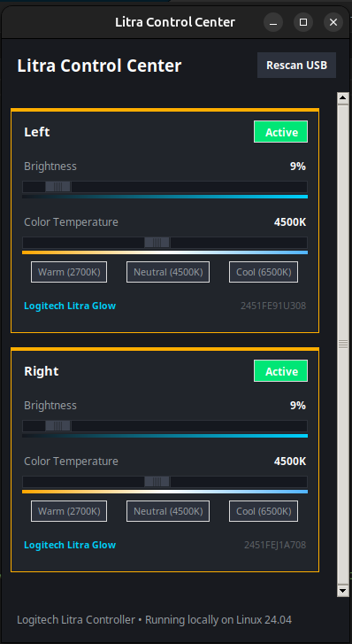
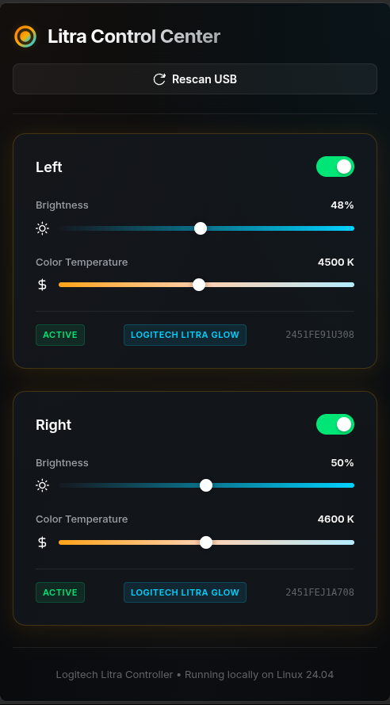

# Logitech Litra Linux Controller (CLI & Desktop GUI)

A premium, local desktop Graphical User Interface (GUI) and Command Line Interface (CLI) to scan, label, and control your USB-connected Logitech Litra lights (Litra Glow, Litra Beam, and Litra Beam LX) on Linux.

Developed in Python (using standard Tkinter and PyUSB), featuring a sleek, dark-theme desktop UI with color-temperature and brightness sliders, inline label renaming, real-time visual gradients, and full CLI control flags.

---

## Screenshots

### Desktop GUI


### Web GUI (Mockup / Legacy)


---

## Features

- **Auto-Detection & Support for Multiple Lights**: Dynamically scans the USB bus and supports controlling multiple Litra devices side-by-side.
- **Dynamic Renaming (Custom Labels)**: Customize device names (e.g., "Left", "Right") by clicking their label text in the GUI or running `litra-control --label`. Labels and states persist locally in `litra_state.json`.
- **Modern Dark-Themed GUI**: Polished, modern desktop interface featuring:
  - Real-time drawn color temperature gradients (warm amber to cool blue) and brightness gradient tracks.
  - Interactive setting demarcation presets (`Warm (2700K)`, `Neutral (4500K)`, and `Cool (6500K)`) for instant shortcuts.
  - Active color highlights (card borders and top bar accent colors switch dynamically when active/standby).
- **Extensible CLI**: Complete terminal command-line options. Easily integrate the controller with custom scripts, home automation, keyboard shortcuts, or cron jobs.
- **Debounced Sliders**: Prevents overloading the USB interface by debouncing fast slider updates in the GUI.
- **Self-Help Troubleshooting**: Shows inline udev permissions helper guides in both CLI and GUI modes when access is denied.

---

## Prerequisites

1. **Install PyUSB:**
   Make sure you have `pip` installed, then run:
   ```bash
   pip install -r requirements.txt
   ```

2. **Install Tkinter (Required for Desktop GUI):**
   On Ubuntu/Debian systems, the Tkinter package is not included by default. Install it by running:
   ```bash
   sudo apt update
   sudo apt install python3-tk
   ```

3. **Configure USB Permissions (UDEV Rules):**
   By default, Linux limits non-root user access to USB devices. To allow this app to read and write control payloads to your Litra lamps:
   
   - Copy the provided rules file to the system rules directory:
     ```bash
     sudo cp 82-litra.rules /etc/udev/rules.d/
     ```
   - Reload the UDEV subsystem to apply the new rules:
     ```bash
     sudo udevadm control --reload-rules && sudo udevadm trigger
     ```
   - Unplug and reconnect your Litra lights to update the permissions.

---

## Running the Application

### 1. Launching the Graphical User Interface (GUI)

To start the desktop GUI dashboard, simply run:
```bash
python3 app.py
```
*(If a graphical display is available, the desktop window will launch immediately).*

### 2. Using the Command Line Interface (CLI)

The application provides complete CLI control flags:

```bash
# Scan and view connected devices
python3 app.py --scan
```

---

## Command Line Interface (CLI) & Extensibility Details

The script and packaged binary support the following terminal flags:

*   **Scan connected devices:**
    ```bash
    python3 app.py --scan
    ```
*   **Turn a light on/off:**
    ```bash
    python3 app.py --device <id> --on
    python3 app.py --device <id> --off
    ```
*   **Set brightness (0-100%):**
    ```bash
    python3 app.py --device <id> --brightness 75
    ```
*   **Set color temperature (2700K - 6500K):**
    ```bash
    python3 app.py --device <id> --temperature 4500
    ```
*   **Set a custom label:**
    ```bash
    python3 app.py --device <id> --label "Left Glow"
    ```

*Note: If only a single device is connected, the `--device <id>` flag can be omitted.*

---

## Production Packaging

You can package this application into a standalone, single-file binary executable (`dist/litra-control`). This allows you to distribute and run the application on other Linux machines without needing a Python environment or Pip packages.

### 1. Compile the standalone binary:
```bash
./build.sh
```
*(This automatically leverages `uv` if present, or creates a local `.venv` to build the app using PyInstaller).*

### 2. Run the production binary:
You can execute the binary just like the Python script, using either GUI or CLI modes:
```bash
# Scan devices
./dist/litra-control --scan

# Toggle device ON
./dist/litra-control --device <id> --on

# Launch desktop GUI
./dist/litra-control
```

---

## Acknowledgements

This controller was built by referencing the Logitech USB HID++ protocols from several outstanding community projects:

*   [kharyam/litra-driver](https://github.com/kharyam/litra-driver) (Python) - Provided foundational routines for PyUSB interface claiming, kernel driver detaching, and raw hex command packet offsets.
*   [jslay88/go-litra-beam](https://github.com/jslay88/go-litra-beam) (Go) - Helped verify command property mappings (`0x4c`, `0x9c`, `0x1c`) and temperature scaling.
*   [timrogers/litra-rs](https://github.com/timrogers/litra-rs) (Rust) - Provided reference details for udev rule setups and device model parameters.
